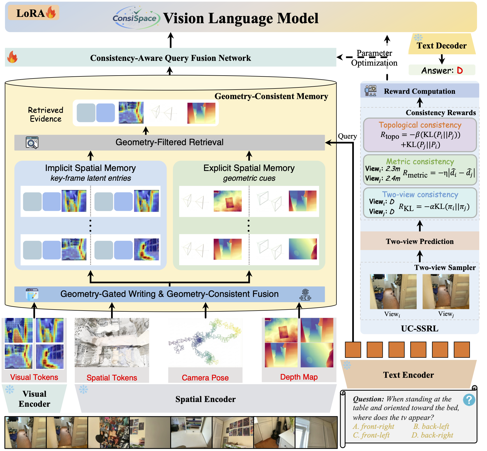

# ConsiSpace: Learning Geometric Consistency Matters for Video Spatial Reasoning

This repository accompanies the paper:

> **ConsiSpace: Learning Geometric Consistency Matters for Video Spatial Reasoning**
>
> [Ting Huang](https://believeht029.github.io/)<sup>2</sup>, [Zhenyu Zhang](https://jessezhang92.github.io/)<sup>1,†</sup>, Wenyuan Huang<sup>1</sup>, Jian Yang<sup>1</sup>, and [Hao Tang](https://ha0tang.github.io/)<sup>2,3,†</sup>
>
> <sup>1</sup> Nanjing University &nbsp; <sup>2</sup> Peking University &nbsp; <sup>3</sup> Beijing Academy of Artificial Intelligence
>
> <sup>†</sup> Corresponding authors.
>
> ### [Paper](https://arxiv.org/abs/2607.17599) | [Website](https://believeht029.github.io/ConsiSpace/) | [Code](https://github.com/Believeht029/ConsiSpace)

## ✏️ Citation

If you find our work useful, please consider starring ⭐ this repository and citing:

```bibtex
@article{huang2026consispace,
  title={ConsiSpace: Learning Geometric Consistency Matters for Video Spatial Reasoning},
  author={Huang, Ting and Zhang, Zhenyu and Huang, Wenyuan and Yang, Jian and Tang, Hao},
  journal={arXiv preprint arXiv:2607.17599},
  year={2026}
}
```

---

## 🏃 Intro ConsiSpace

ConsiSpace improves video spatial reasoning by using geometric consistency to organize visual evidence and stabilize answers across viewpoints.

Understanding spatial relationships in long videos requires a model to retain useful observations while handling repeated views and changing camera poses. ConsiSpace combines frozen **SigLIP2** visual features and **VGGT** spatial features with **Qwen3-VL-8B-Instruct**. Its **Geometry-Consistent Memory (GCM)** uses pose and depth cues to guide memory writing, fusion, and hierarchical retrieval. After supervised fine-tuning, **Unified Consistency Self-Supervised Reinforcement Learning (UC-SSRL)** encourages agreement across paired views through answer, metric, and topological consistency rewards.



### Main Results

The following results are reported in the paper. They are not measurements from running this implementation.

| Benchmark | Setting | Strongest baseline | ConsiSpace (UC-SSRL) | Gain |
|---|---|---:|---:|---:|
| VSI-Bench | Overall average | 69.6 | **76.6** | +7.0 |
| OSI-Bench | Overall average | 40.3 | **53.0** | +12.7 |
| MMSI-Video-Bench | Sufficient-Coverage | 42.6 | **57.5** | +14.9 |
| MMSI-Video-Bench | Uniform-50 | 43.1 | **58.1** | +15.0 |

## 📰 News

- 📣 The paper and project page are available through the links above.
- 🛠️ The repository includes GCM, training and prediction entry points, and offline evaluation scripts for the three benchmarks.

## TODO List

- [x] Upload the paper to arXiv and build the project page.
- [x] Upload the implementation, including training, prediction, and evaluation scripts.
- [ ] Release model checkpoints.

## 📦 Data Preparation

The paper uses indoor **VSI-590K** and outdoor **nuScenes-10K** for supervised instruction tuning. This repository does not bundle those datasets, videos, annotations, or model weights. Prepare the appropriate training splits and keep benchmark evaluation data separate.

### 1. Prepare frame annotations

Use JSONL records with a unique `id`, a `question`, and chronologically ordered frame paths. SFT records also require an `answer`. Paths are relative to the input JSONL directory; `timestamps`, when supplied, are in seconds. The extractor accepts frame images rather than raw video files.

```json
{"id":"scene-001","frames":["frames/000.jpg","frames/001.jpg","frames/002.jpg"],"timestamps":[0.0,0.5,1.0],"question":"How many chairs are visible in this room?","answer":"3","meters_per_unit":null}
```

See [the raw annotation example](examples/raw_sft.jsonl). Example paths and answers illustrate the format and must be replaced with actual data.

**Geometry scale:** the default configuration uses meter-based writing and fusion thresholds. Supply a positive, calibrated `meters_per_unit` to convert VGGT camera translations and depth into meters; do not assume that monocular predictions already have metric scale. If calibration is unavailable, explicitly set `normalize_scene_scale=true` in a separate configuration before alignment. This alternative normalizes the whole scene by its median depth and uses relative-scale thresholds; it differs from the paper's meter-based setting.

### 2. Extract frozen features

After installing the dependencies below, extract SigLIP2 and VGGT features:

```bash
consispace-extract \
  --data /path/to/raw_train.jsonl \
  --config configs/consispace.json \
  --output data/train_cache
```

The output directory contains feature caches and `manifest.jsonl`, which is the input to training. Each cache stores visual/spatial tokens, camera-to-world poses, depth, timestamps, original frame IDs, and a question-specific text embedding. Changing a question requires regenerating its cache. Frames are reconstructed jointly so paired views share one geometry coordinate system.

### 3. Prepare paired-view records

UC-SSRL records use the same feature-cache interface and add a shared answer-candidate set. See [the UC-SSRL examples](examples/ssrl.jsonl).

- `candidates`: at least two distinct answer strings, such as the choices in a multiple-choice question.
- `metric_values` and `metric_unit`: optional numerical values aligned with the candidates, all in the same unit.
- `relation_groups`: optional relation-group IDs aligned with the candidates.
- `view_invariant: true`: declares that the question retains its meaning across the sampled views.
- `anchor_frame_ids`: optional original frame IDs that define required reference observations.

UC-SSRL does not read ground-truth `answer` fields. Its current implementation normalizes answer probabilities over the shared candidate set and computes the consistency objective on that finite support. This is an explicit implementation choice, not an unrestricted free-text rollout or GRPO implementation. Ensure viewpoint-dependent questions retain their reference frame and remain answerable after sampling.

## ⚙️ Environment Setup

Use Python 3.10 or later. Training and feature extraction are intended for a CUDA environment.

```bash
# Core implementation and frozen geometry encoder dependencies
pip install -e '.[geometry]'

# Optional: DeepSpeed and FlashAttention
pip install -e '.[distributed]'

# Optional: FAISS retrieval acceleration
pip install -e '.[retrieval]'

# Optional: read Parquet benchmark annotations
pip install -e '.[eval-data]'
```

Dependencies are defined in [pyproject.toml](pyproject.toml), including `transformers==4.57.1`. The default attention backend is SDPA; select `--attention flash_attention_2` after installing a compatible FlashAttention build. Model weights are loaded from the identifiers or local paths configured in [configs/consispace.json](configs/consispace.json).

## 🚀 Training

The paper's two stages are SFT and UC-SSRL. This implementation additionally provides an optional bridge-alignment stage for initializing the new memory and projection modules when compatible pretrained bridge weights are unavailable.

### Bridge Initialization

Train the new GCM and alignment modules while keeping the language backbone and LoRA frozen:

```bash
consispace-train --stage align \
  --data data/train_cache/manifest.jsonl \
  --config configs/consispace.json \
  --output outputs/align \
  --gradient-checkpointing
```

This is an engineering initialization step, not an additional stage reported in the paper. SFT requires a trained bridge checkpoint; the implementation does not silently freeze a randomly initialized bridge.

### Stage 1: Supervised Fine-Tuning

Initialize from the bridge checkpoint and update only the language-model LoRA parameters:

```bash
consispace-train --stage sft \
  --data data/train_cache/manifest.jsonl \
  --checkpoint outputs/align \
  --output outputs/sft \
  --gradient-checkpointing
```

The loss supervises assistant answer tokens and the answer terminator. The visual and geometry encoders, language backbone, GCM, and aligner remain frozen.

### Stage 2: UC-SSRL

Initialize from the completed SFT checkpoint:

```bash
consispace-train --stage ssrl \
  --data /path/to/ssrl_manifest.jsonl \
  --checkpoint outputs/sft \
  --output outputs/ssrl \
  --gradient-checkpointing
```

The sampler perturbs temporal windows and evidence sets while preserving declared anchors. Answer KL, numerical consistency, and symmetric relational KL provide the learning signal; only LoRA parameters are updated.

### Configuration and Multi-GPU Training

| Component | Default |
|---|---|
| Language backbone | Qwen3-VL-8B-Instruct |
| Frozen encoders | SigLIP2 base / patch16 / 512; VGGT-1B |
| LoRA | Rank 16, alpha 32 |
| Memory read budget | 64 tokens, dimension 512 |
| Memory organization | Up to 4 chunks; 8 values per chunk, 4 per selected frame |
| Retrieval | Chunk top-k 8, frame top-k 8, capped by available entries |
| Layer injection | After layers 8, 12, 16, …, using one-based numbering |
| Writing thresholds | 0.15 m / 15° |
| Fusion thresholds | 0.40 m / 30° |
| Optimizer | AdamW, learning rate 1e-4 |
| Per-device batch / accumulation | 1 / 2 |
| Optimization steps | 200 per stage by default |
| Maximum sequence length | 5,120, including memory slots |
| Precision / UC-SSRL weight | bfloat16 / 0.01 |

The 64-token budget bounds the context read into the language model, not the entire scene cache. Geometry extraction and retained memory entries can still grow with video length.

An eight-GPU ZeRO-3 launch uses the supplied [DeepSpeed configuration](configs/zero3.json):

```bash
accelerate launch --num_processes 8 --use_deepspeed -m consispace.train \
  --stage sft --data data/train_cache/manifest.jsonl \
  --checkpoint outputs/align --output outputs/sft-zero3 \
  --deepspeed configs/zero3.json \
  --attention flash_attention_2 --gradient-checkpointing
```

Use separate output directories for each stage. Exports contain bridge weights, LoRA weights, configuration, and tokenizer files; the original backbone weights remain external. Add `--save-state` to save optimizer and RNG state. To continue the same stage, provide its model directory through `--checkpoint` and its `training_state` directory through `--resume-state`; `--steps` specifies the total target step count.

Under ZeRO-3, UC-SSRL records in a run must have the same candidate count. Split data by candidate count or use ordinary DDP when counts differ.

## 🔍 Inference and Evaluation

### Generate Answers

Prepare feature caches for the evaluation questions, then use a completed SFT or UC-SSRL checkpoint:

```bash
consispace-predict \
  --checkpoint outputs/ssrl \
  --data /path/to/eval_cache/manifest.jsonl \
  --output outputs/predictions.jsonl \
  --max-new-tokens 128
```

Predictions include a stable sample ID, the answer, and retrieval provenance. The current decoder recomputes the full context without a KV cache; paper-level latency and memory results have not been validated with this implementation.

### Score Saved Predictions

The offline [evaluation entry point](consispace/evaluate.py) supports JSONL, JSON arrays, CSV, TSV, and optional Parquet input. JSON/text-file scoring uses only the Python standard library and does not load a model.

```bash
python -m consispace.evaluate --benchmark vsi \
  --annotations /path/to/vsi_annotations.jsonl \
  --predictions outputs/vsi_predictions.jsonl \
  --output outputs/eval/vsi.json --details outputs/eval/vsi_samples.jsonl

python -m consispace.evaluate --benchmark osi --protocol benchmark \
  --annotations /path/to/osi_annotations.parquet \
  --predictions outputs/osi_predictions.jsonl \
  --output outputs/eval/osi.json

python -m consispace.evaluate --benchmark mmsi --setting uniform-50 \
  --annotations /path/to/mmsi_annotations.jsonl \
  --predictions outputs/mmsi_u50_predictions.jsonl \
  --output outputs/eval/mmsi_u50.json
```

Run MMSI Sufficient-Coverage separately with `--setting sufficient-coverage` and the corresponding predictions. The setting is declared metadata; the scorer does not verify the frame sampling used to generate answers.

Annotations and predictions are joined by unique `id`, `question_id`, `uid`, or `index`. Ground truth defaults to `ground_truth` / `answer` / `target`, and predictions to `prediction` / `answer` / `response`. Use VSI's native `question_type`, OSI's `category`, and optionally MMSI's `category` for task reporting. Custom field names can be passed through the entry point's field-selection arguments.

VSI reports the task macro average, merging relative-direction difficulty groups first. OSI reports the sample-weighted average. MMSI uses exact match. Reports also include category scores, missing predictions, parsing failures, and input hashes. Missing predictions count as zero; duplicate IDs are rejected.

The default `--protocol paper` uses the paper's strict MRA threshold comparison. `--protocol benchmark` follows the referenced VSI/OSI parsing and threshold conventions, including OSI's special handling of zero motion. `--answer-parser final` optionally extracts explicitly marked final answers. Keep these settings consistent across models. No numerical comparison against official scorers has been executed.

## 🌟 Star History

[](https://www.star-history.com/#Believeht029/ConsiSpace&type=date&legend=top-left)

## 😘 Acknowledgement

We thank the authors and contributors of [Qwen3-VL](https://github.com/QwenLM/Qwen3-VL), [SigLIP2](https://github.com/google-research/big_vision), [VGGT](https://github.com/facebookresearch/vggt), [Transformers](https://github.com/huggingface/transformers), and [PEFT](https://github.com/huggingface/peft) for their open-source work. We also thank the teams behind [VSI-Bench](https://github.com/vision-x-nyu/thinking-in-space), [OSI-Bench](https://github.com/mingrui-wu/OSI-Bench), and [MMSI-Video-Bench](https://github.com/InternRobotics/MMSI-Video-Bench).

## 📄 License and Contact

Original ConsiSpace code is provided under the [MIT License](LICENSE).

For questions, please contact [Zhenyu Zhang](mailto:zhangjesse@foxmail.com).
